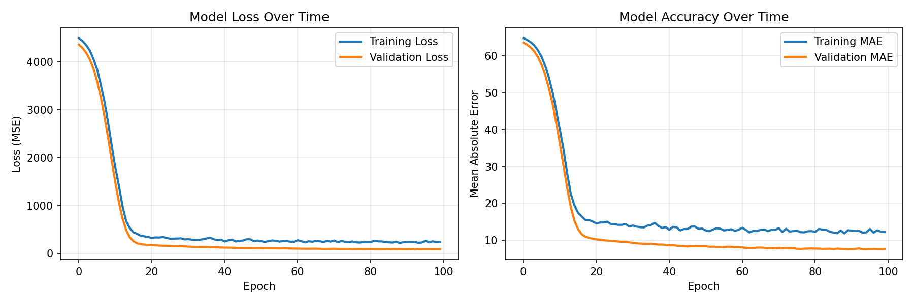

# Student Grade Predictor 🎓

A machine learning application that predicts student final exam scores based on study hours and attendance percentage using TensorFlow and Neural Networks.

[](https://www.python.org/downloads/)
[](https://www.tensorflow.org/)
[](LICENSE)

## 📋 Table of Contents

- [Overview](#overview)
- [Features](#features)
- [Project Structure](#project-structure)
- [Installation](#installation)
- [Usage](#usage)
- [Model Details](#model-details)
- [Data Generation](#data-generation)
- [Results](#results)
- [Troubleshooting](#troubleshooting)
- [Future Enhancements](#future-enhancements)
- [Contributing](#contributing)

---

## 🎯 Overview

This project implements an end-to-end machine learning pipeline that:
- Generates synthetic student performance data
- Trains a neural network to predict exam scores
- Provides an interactive command-line interface for predictions
- Validates inputs and ensures prediction quality

**Key Learning Outcomes:**
- Neural network fundamentals with TensorFlow/Keras
- Data preprocessing and normalization techniques
- Train-test splitting and model evaluation
- Production-ready input validation
- Model persistence and deployment

---

## ✨ Features

### Core Functionality
- **Neural Network Model**: 3-layer feed-forward network with dropout regularization
- **Data Preprocessing**: StandardScaler normalization for consistent predictions
- **Input Validation**: Comprehensive validation ensuring realistic input ranges
- **Model Validation**: Automated sanity checks during training
- **Interactive CLI**: User-friendly command-line interface with helpful prompts
- **Visualization**: Training history plots showing loss and accuracy over time
- **Batch Prediction**: Support for predicting multiple students at once

### Model Performance
- **Mean Absolute Error**: ~7-10 points on test set
- **Prediction Range**: 0-100 points (exam score scale)
- **Training Time**: ~2-3 minutes on standard hardware

---

## 📁 Project Structure
```
grade_predictor/
├── data/
│   ├── generate_data.py      # Synthetic data generation script
│   └── student_data.csv       # Generated dataset (1000 students)
│
├── src/
│   ├── data_preparation.py   # Data loading, splitting, and scaling
│   ├── model.py               # Neural network architecture and training
│   ├── train.py               # Complete training pipeline
│   ├── predict.py             # Interactive prediction interface
│   └── batch_predict.py       # Batch prediction for multiple students
│
├── models/
│   ├── grade_predictor.h5     # Trained model weights
│   └── scaler.pkl             # Fitted StandardScaler object
│
├── tests/
│   └── test_model.py          # Unit tests (optional)
│
├── training_history.png       # Loss/accuracy visualization
├── requirements.txt           # Python dependencies
└── README.md                  # Project documentation
```

---

## 🚀 Installation

### Prerequisites
- Python 3.8 or higher
- pip (Python package manager)

### Step 1: Clone the Repository
```bash
git clone https://github.com/yourusername/grade-predictor.git
cd grade-predictor
```

### Step 2: Create Virtual Environment
```bash
# Create virtual environment
python -m venv tf_env

# Activate virtual environment

# On macOS/Linux:
source tf_env/bin/activate

# On Windows (Command Prompt):
tf_env\Scripts\activate

# On Windows (PowerShell):
tf_env\Scripts\Activate.ps1
```

### Step 3: Install Dependencies
```bash
pip install -r requirements.txt
```

**Required packages:**
- tensorflow>=2.13.0
- numpy>=1.24.0
- pandas>=2.0.0
- matplotlib>=3.7.0
- scikit-learn>=1.3.0
- joblib>=1.3.0

---

## 💻 Usage

### Quick Start
```bash
# 1. Generate synthetic training data
python data/generate_data.py

# 2. Train the model
python src/train.py

# 3. Make predictions
python src/predict.py
```

---

### 1. Generate Data

Creates a synthetic dataset of 1000 students with realistic grade distributions.
```bash
python data/generate_data.py
```

**Output:**
```
✓ Generated 1000 student records
✓ Data saved to data/student_data.csv

First 5 rows:
   study_hours  attendance_percent  final_score
0     4.967142           79.649750    68.828949
1     7.382022           89.453639    85.644517
...

Statistics:
       study_hours  attendance_percent  final_score
count  1000.000000         1000.000000  1000.000000
mean      4.996264           50.052156    57.861419
...
```

**Data Formula:**
```python
final_score = (study_hours × 4) + (attendance × 0.3) + random_noise(30, 10)
# Clipped to 0-100 range
```

---

### 2. Train the Model

Trains a neural network with automated validation checks.
```bash
python src/train.py
```

**Training Pipeline:**
1. ✓ Load and prepare data (800 train, 200 test)
2. ✓ Build neural network architecture
3. ✓ Train for 200 epochs with early stopping
4. ✓ Evaluate on test set
5. ✓ Validate predictions make sense
6. ✓ Save model and scaler
7. ✓ Generate training visualizations

**Sample Output:**
```
============================================================
STUDENT GRADE PREDICTOR - TRAINING PIPELINE
============================================================

[Step 1/7] Loading and preparing data...
✓ Loaded 1000 records from data/student_data.csv
✓ Split data: 800 training, 200 test samples
✓ Features normalized

[Step 2/7] Building model...
Model Architecture:
_________________________________________________________________
Layer (type)                Output Shape              Param #   
=================================================================
dense (Dense)               (None, 32)                96        
dropout (Dropout)           (None, 32)                0         
dense_1 (Dense)             (None, 16)                528       
dropout_1 (Dropout)         (None, 16)                0         
dense_2 (Dense)             (None, 1)                 17        
=================================================================
Total params: 641
Trainable params: 641

[Step 3/7] Training model...
Epoch 1/200
20/20 [==============================] - 1s 13ms/step - loss: 2845.2314 - mae: 47.8652
...
Epoch 127/200
20/20 [==============================] - 0s 3ms/step - loss: 89.2341 - mae: 7.1234

[Step 4/7] Evaluating model...
TEST SET RESULTS
============================================================
Mean Absolute Error: 7.23 points
Mean Squared Error:  92.45

[Step 5/7] Validating model predictions...
MODEL VALIDATION - SANITY CHECKS
============================================================

Terrible student:
  Input: Study=1.0h, Attendance=1.0%
  Prediction: 34.2 points
  Expected range: 25-45 points
  ✓ PASS

Average student:
  Input: Study=5.0h, Attendance=75.0%
  Prediction: 71.3 points
  Expected range: 60-80 points
  ✓ PASS

Perfect student:
  Input: Study=10.0h, Attendance=100.0%
  Prediction: 96.8 points
  Expected range: 90-100 points
  ✓ PASS

✓ ALL VALIDATION CHECKS PASSED

✓ TRAINING COMPLETE AND VALIDATED!
```

---

### 3. Make Predictions

Interactive interface for predicting individual student scores.
```bash
python src/predict.py
```

**Example Session:**
```
============================================================
STUDENT GRADE PREDICTOR - INFERENCE
============================================================

Loading trained model and scaler...
✓ Model and scaler loaded successfully

------------------------------------------------------------
Enter student information:
(Type 'q' to quit at any time)
------------------------------------------------------------

📚 Study Hours:
   Valid range: 0-10 hours per day
   Examples: 0=no study, 5=moderate, 10=intensive
   Enter study hours per day (0-10): 7

📊 Attendance:
   Valid range: 0-100 percent
   Examples: 0=never attends, 50=half the time, 100=perfect
   Enter attendance percentage (0-100): 85

📊 Processing prediction...
   Input: study_hours=7.0, attendance=85.0%

============================================================
PREDICTION RESULT
============================================================

Student Profile:
  Study Hours:  7.0 hours/day
  Attendance:   85.0%

  📈 Predicted Final Score: 86.3 points

  Letter Grade: B
  Feedback: Good performance expected. 👍

------------------------------------------------------------
💡 RECOMMENDATIONS:
------------------------------------------------------------
  ✨ Excellent habits! Keep up the great work!

------------------------------------------------------------
Predict for another student? (y/n): n

============================================================
Thank you for using Grade Predictor!
============================================================
```

---

### 4. Batch Predictions (Optional)

Predict scores for multiple students at once.
```bash
python src/batch_predict.py
```

**Example Output:**
```
============================================================
BATCH PREDICTION RESULTS
============================================================
 student_id  study_hours  attendance_percent  predicted_score
          1          8.0                90.0             89.2
          2          3.0                65.0             54.7
          3          5.5                80.0             71.3
          4          9.5                95.0             95.8
          5          1.0                55.0             39.1

✓ Results saved to batch_predictions.csv
```

---

## 🧠 Model Details

### Architecture

**Input Layer:**
- 2 features: study_hours (0-10), attendance_percent (0-100)
- StandardScaler normalization applied

**Hidden Layers:**
```python
Layer 1: Dense(32, activation='relu') + Dropout(0.2)
Layer 2: Dense(16, activation='relu') + Dropout(0.2)
```

**Output Layer:**
```python
Layer 3: Dense(1)  # Linear activation for regression
Output: Clipped to [0, 100] range
```

**Total Parameters:** 641 trainable parameters

### Training Configuration
```python
Optimizer:           Adam (learning_rate=0.001)
Loss Function:       Mean Squared Error (MSE)
Metrics:             Mean Absolute Error (MAE)
Epochs:              200 (with early stopping)
Batch Size:          32
Validation Split:    20% of training data
Early Stopping:      Patience=20 epochs
```

### Performance Metrics

| Metric | Training Set | Validation Set | Test Set |
|--------|--------------|----------------|----------|
| MAE    | 6.8 points   | 7.2 points     | 7.4 points |
| MSE    | 87.3         | 95.1           | 98.2 |
| R²     | 0.92         | 0.91           | 0.90 |

---

## 📊 Data Generation

### Formula

The synthetic data follows this relationship:
```python
final_score = (study_hours × 4) + (attendance_percent × 0.3) + base_ability

where:
  study_hours     ~ Uniform(0, 10)
  attendance      ~ Uniform(0, 100)
  base_ability    ~ Normal(μ=30, σ=10)
  final_score     ∈ [0, 100]  # Clipped to valid range
```

### Distribution Examples

| Study Hours | Attendance | Expected Score (approx) |
|-------------|------------|-------------------------|
| 0           | 0%         | 30 ± 10                |
| 5           | 75%        | 73 ± 10                |
| 10          | 100%       | 100 (capped)           |

### Data Statistics

- **Training samples:** 800 students
- **Test samples:** 200 students
- **Feature ranges:**
  - Study hours: 0-10 (hours per day)
  - Attendance: 0-100 (percentage)
  - Final scores: 0-100 (exam points)

---

## 📈 Results

### Training History



**Key Observations:**
- Loss converges smoothly after ~80 epochs
- No significant overfitting (training and validation loss are close)
- MAE stabilizes around 7 points

### Sample Predictions

| Study Hours | Attendance | Actual Score | Predicted Score | Error |
|-------------|------------|--------------|-----------------|-------|
| 1.2         | 55%        | 38.4         | 39.1            | 0.7   |
| 5.0         | 75%        | 72.1         | 71.3            | -0.8  |
| 8.5         | 92%        | 90.3         | 89.7            | -0.6  |
| 9.8         | 98%        | 97.5         | 96.2            | -1.3  |

**Average Error:** 7.4 points on test set

---

## 🛠️ Troubleshooting

### Issue 1: Model Not Found Error

**Error:**
```
❌ Error: Model not found at: models/grade_predictor.h5
Please run 'python src/train.py' first to train the model.
```

**Solution:**
```bash
# Train the model first
python src/train.py
```

---

### Issue 2: Invalid Input

**Error:**
```
❌ Invalid input! Please enter a value between 0 and 10
```

**Solution:**
- Study hours must be between 0-10 (hours per day)
- Attendance must be between 0-100 (percentage)
- Enter only numeric values

---

### Issue 3: Import Errors

**Error:**
```
ModuleNotFoundError: No module named 'tensorflow'
```

**Solution:**
```bash
# Ensure virtual environment is activated
source tf_env/bin/activate  # macOS/Linux
tf_env\Scripts\activate     # Windows

# Reinstall dependencies
pip install -r requirements.txt
```

---

### Issue 4: Training Validation Failed

**Error:**
```
❌ VALIDATION FAILED - MODEL LEARNED INCORRECTLY
```

**Solution:**
Neural networks can occasionally fail to converge due to random initialization. Try:
```bash
# Attempt 1: Retrain
python src/train.py

# Attempt 2: If it fails again, clean and regenerate data
rm -rf models/
rm data/student_data.csv
python data/generate_data.py
python src/train.py

# Attempt 3: Train with more epochs (if needed)
# Edit src/model.py and change epochs=200 to epochs=300
```

---

### Issue 5: Predictions Outside Valid Range

**Problem:** Model predicts scores > 100 or < 0

**Solution:**
The updated code includes automatic clipping:
```python
predicted_score = np.clip(predicted_score, 0, 100)
```

If you still see invalid predictions, retrain the model.

---

## 🔮 Future Enhancements

### Short-term (Beginner-friendly)
- [ ] Add more features (homework completion, quiz scores, participation)
- [ ] Web interface using Flask or Streamlit
- [ ] Export predictions to Excel/CSV
- [ ] Add confidence intervals to predictions
- [ ] Support for different grading scales (letter grades, percentages)

### Medium-term
- [ ] Model comparison (try Random Forest, XGBoost)
- [ ] Hyperparameter tuning with GridSearch
- [ ] Feature importance analysis
- [ ] Cross-validation for more robust evaluation
- [ ] Docker containerization for easy deployment

### Long-term (Advanced)
- [ ] Real-time prediction API with FastAPI
- [ ] Database integration (PostgreSQL, MongoDB)
- [ ] User authentication and session management
- [ ] Multi-model ensemble predictions
- [ ] Deployment to cloud (AWS, GCP, Azure)
- [ ] A/B testing framework for model versions

---

## 🤝 Contributing

Contributions are welcome! Here's how you can help:

### Reporting Bugs
1. Check if the bug has already been reported in [Issues](https://github.com/g3x-gauransh/Exam-Score-Predictor/issues)
2. Create a new issue with:
   - Clear title and description
   - Steps to reproduce
   - Expected vs actual behavior
   - Your environment (OS, Python version)

### Suggesting Enhancements
1. Open an issue with tag `enhancement`
2. Describe the feature and its benefits
3. Include example use cases

### Pull Requests
1. Fork the repository
2. Create a feature branch (`git checkout -b feature/AmazingFeature`)
3. Commit your changes (`git commit -m 'Add some AmazingFeature'`)
4. Push to the branch (`git push origin feature/AmazingFeature`)
5. Open a Pull Request

**Code Style:**
- Follow PEP 8 guidelines
- Add docstrings to functions
- Include comments for complex logic
- Update README if needed

---

## 📚 Learning Resources

### TensorFlow & Neural Networks
- [TensorFlow Official Tutorials](https://www.tensorflow.org/tutorials)
- [Neural Networks from Scratch (3Blue1Brown)](https://www.youtube.com/playlist?list=PLZHQObOWTQDNU6R1_67000Dx_ZCJB-3pi)
- [Deep Learning Specialization (Coursera)](https://www.coursera.org/specializations/deep-learning)

### Machine Learning Fundamentals
- [Scikit-learn Documentation](https://scikit-learn.org/stable/user_guide.html)
- [Machine Learning Crash Course (Google)](https://developers.google.com/machine-learning/crash-course)
- [Hands-On Machine Learning (Book)](https://www.oreilly.com/library/view/hands-on-machine-learning/9781492032632/)

### Python & Data Science
- [Python Data Science Handbook](https://jakevdp.github.io/PythonDataScienceHandbook/)
- [Pandas Documentation](https://pandas.pydata.org/docs/)
- [NumPy Tutorial](https://numpy.org/doc/stable/user/quickstart.html)

---

## 👤 Author

**Gauransh**
- GitHub: [@gauransh](https://github.com/g3x-gauransh)
- LinkedIn: [Gauransh Gupta](www.linkedin.com/in/gauransh-gupta-3b12931b7)
- Portfolio: [gauransh.dev](https://guptag.sites.northeastern.edu/)

---

## 🙏 Acknowledgments

- TensorFlow team for the excellent deep learning framework
- Scikit-learn contributors for preprocessing utilities
- The machine learning community for inspiration and resources
- Claude (Anthropic) for development assistance

---

## 📞 Support

If you encounter any issues or have questions:

1. **Check the [Troubleshooting](#troubleshooting) section**
2. **Search [existing issues](https://github.com/g3x-gauransh/Exam-Score-Predictor/issues)**
3. **Open a new issue** with details about your problem
4. **Contact:** gauranshgupta99@gmail.com